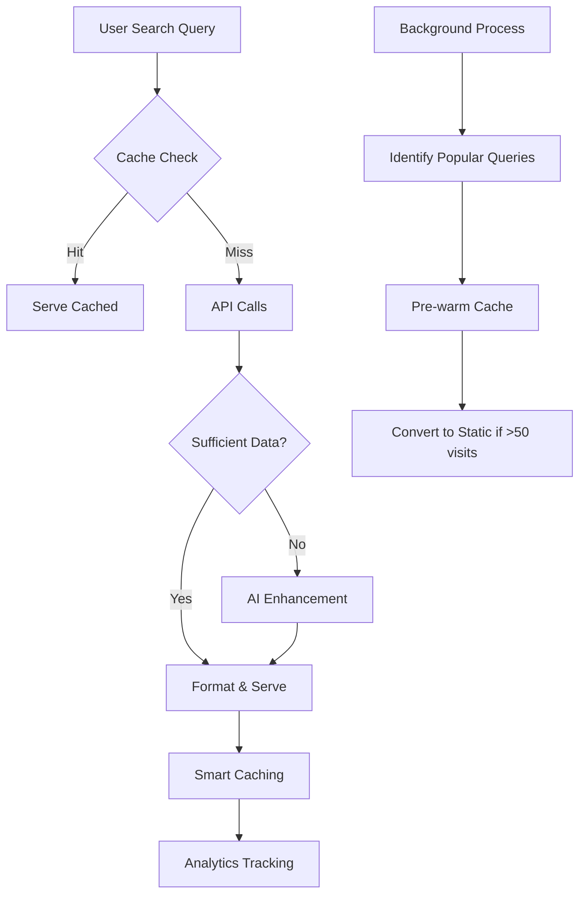

# Product Requirements Document (PRD)
# PairDish - Smart Food Pairing Platform with Dynamic Content Generation

## Document Information
- **Version:** 3.0
- **Date:** January 2025
- **Status:** Planning - Smart Hybrid System
- **Product Owner:** Abdul Rahim

---

## 1. Executive Summary

PairDish is an intelligent food pairing platform that dynamically generates content on-demand using a Smart Hybrid System combining external APIs and AI. Instead of pre-creating thousands of pages, the platform generates pairing suggestions in real-time when users search, dramatically reducing costs and maintenance while providing unlimited scalability.

### Key Innovation: Smart Hybrid System
- **Dynamic Generation:** Pages created on-demand when users visit
- **API-First:** Real recipe data from RapidAPI (Spoonacular, Edamam, TheMealDB)
- **AI Fallback:** Generate content when APIs lack data
- **Smart Caching:** Popular content cached progressively
- **Zero Waste:** Only create what users actually search for

### Core Benefits
- **Cost Efficiency:** ~$15-40/month vs $500+/month traditional approach
- **Infinite Scale:** Handle any dish query without pre-planning
- **Real-Time Updates:** Change content globally in seconds
- **No Maintenance:** No database of 75,000 pages to manage
- **SEO Friendly:** Dynamic pages still get indexed by Google

---

## 2. Smart Hybrid System Architecture

### 2.1 Dynamic Content Generation Flow

```
User searches: "what to serve with chicken biryani"
                            │
                            ▼
                 ┌─────────────────────┐
                 │   Check Cache       │
                 │  (Redis/CDN/KV)     │
                 └──────────┬──────────┘
                           │
                 ┌─────────┴─────────┐
                 │                   │
            Found │              Not Found
                 │                   │
                 ▼                   ▼
         ┌──────────────┐   ┌───────────────────┐
         │ Serve Cached │   │ Generate Content  │
         │   (<100ms)   │   │    Dynamically    │
         └──────────────┘   └─────────┬─────────┘
                                      │
                            ┌─────────▼─────────┐
                            │ 1. Try Free APIs │
                            │   (TheMealDB)    │
                            └─────────┬─────────┘
                                     │ Not Found
                            ┌────────▼─────────┐
                            │ 2. Try Paid APIs │
                            │ (Spoonacular,    │
                            │  Edamam)         │
                            └────────┬─────────┘
                                    │ Not Found
                            ┌───────▼──────────┐
                            │ 3. AI Generation │
                            │ (GPT-4/Claude)   │
                            └───────┬──────────┘
                                    │
                            ┌───────▼──────────┐
                            │  Cache Result    │
                            │ Based on Usage   │
                            └───────┬──────────┘
                                    │
                            ┌───────▼──────────┐
                            │  Serve to User   │
                            │   (2-3 seconds)  │
                            └──────────────────┘
```

### 2.2 Smart Caching Strategy

```
Visit Frequency → Cache Duration → Storage Location
━━━━━━━━━━━━━━━━━━━━━━━━━━━━━━━━━━━━━━━━━━━━━━━
1 visit         → 24 hours      → Memory only
2-5 visits      → 48 hours      → Memory + Redis
6-20 visits     → 7 days        → Redis + CDN
21-50 visits    → 30 days       → CDN + Database
50+ visits      → Permanent*    → Static Generation

*Only top ~100 pages ever reach permanent status
```

### 2.3 Page Generation Strategy

#### Static Pages (Pre-built)
1. **Homepage** (`/`)
2. **About** (`/about`)
3. **Contact** (`/contact`)
4. **Privacy/Terms** (`/privacy`, `/terms`)
5. **Popular Dishes** (Top 20-50 based on analytics)

#### Dynamic Pages (Generated On-Demand)
1. **Dish Pairing Pages** (`/what-to-serve-with-{any-dish}`)
   - Generated when first visitor arrives
   - Cached based on popularity
   - Unlimited possibilities

2. **Recipe Pages** (`/recipe/{any-recipe}`)
   - Created when accessed from pairing page
   - Pulled from APIs or generated
   - Progressive caching

3. **Search Results** (`/search?q={query}`)
   - Real-time results
   - No pre-indexing needed

4. **Browse Pages** (Semi-dynamic)
   - Categories/Cuisines populated from actual content
   - Updated as new dishes are discovered

### 2.4 API Integration Architecture

```
Primary APIs (via RapidAPI):
┌─────────────────┬──────────────┬────────────┬───────────┐
│ API Provider    │ Use Case     │ Free Tier  │ Cost/req  │
├─────────────────┼──────────────┼────────────┼───────────┤
│ TheMealDB       │ Basic recipes│ Unlimited  │ FREE      │
│ Edamam          │ Nutrition    │ 10k/month  │ $0.0003   │
│ Spoonacular     │ Pairings     │ 150/day    │ $0.01     │
│ AI (Fallback)   │ Any content  │ N/A        │ $0.002    │
└─────────────────┴──────────────┴────────────┴───────────┘

API Priority Waterfall:
1. Check cache first (0ms, $0)
2. Try free APIs (100-500ms, $0)
3. Try freemium APIs within quota (200-800ms, $0)
4. Use paid API calls (200-800ms, $0.0003-0.01)
5. Fallback to AI generation (2-3s, $0.002)
```

---

## 3. Database Architecture (Simplified for Dynamic System)

### 3.1 Minimal Database Schema

Since content is generated dynamically, we only need to store:
1. Cache metadata
2. Popular/permanent content
3. Analytics data
4. Basic configuration

#### Core Tables

```sql
-- Cache metadata table
CREATE TABLE cache_entries (
  id INTEGER PRIMARY KEY AUTOINCREMENT,
  cache_key TEXT UNIQUE NOT NULL,
  content_type TEXT NOT NULL, -- 'dish', 'recipe', 'search'
  dish_slug TEXT,
  hit_count INTEGER DEFAULT 1,
  last_accessed DATETIME DEFAULT CURRENT_TIMESTAMP,
  ttl INTEGER NOT NULL, -- Time to live in seconds
  source TEXT, -- 'api:themealdb', 'api:spoonacular', 'ai:gpt4', etc.
  created_at DATETIME DEFAULT CURRENT_TIMESTAMP
);

-- Popular content (promoted to semi-permanent)
CREATE TABLE popular_dishes (
  id INTEGER PRIMARY KEY AUTOINCREMENT,
  name TEXT NOT NULL,
  slug TEXT UNIQUE NOT NULL,
  monthly_searches INTEGER DEFAULT 0,
  total_views INTEGER DEFAULT 0,
  avg_time_on_page INTEGER DEFAULT 0,
  content_json TEXT, -- Cached content
  api_data_json TEXT, -- Cached API responses
  status TEXT DEFAULT 'dynamic', -- 'dynamic', 'cached', 'static'
  created_at DATETIME DEFAULT CURRENT_TIMESTAMP,
  updated_at DATETIME DEFAULT CURRENT_TIMESTAMP
);

-- Analytics table
CREATE TABLE page_analytics (
  id INTEGER PRIMARY KEY AUTOINCREMENT,
  page_type TEXT NOT NULL,
  page_slug TEXT NOT NULL,
  visitor_id TEXT,
  time_on_page INTEGER,
  bounce BOOLEAN DEFAULT FALSE,
  clicked_recipe BOOLEAN DEFAULT FALSE,
  search_query TEXT,
  referrer TEXT,
  created_at DATETIME DEFAULT CURRENT_TIMESTAMP
);

-- API usage tracking
CREATE TABLE api_usage (
  id INTEGER PRIMARY KEY AUTOINCREMENT,
  api_name TEXT NOT NULL,
  endpoint TEXT NOT NULL,
  success BOOLEAN,
  response_time INTEGER, -- milliseconds
  cost DECIMAL(10,4),
  error_message TEXT,
  created_at DATETIME DEFAULT CURRENT_TIMESTAMP
);

-- Search queries tracking
CREATE TABLE search_queries (
  id INTEGER PRIMARY KEY AUTOINCREMENT,
  query TEXT NOT NULL,
  normalized_query TEXT NOT NULL,
  results_count INTEGER,
  clicked_result TEXT,
  created_at DATETIME DEFAULT CURRENT_TIMESTAMP
);

-- Minimal configuration tables
CREATE TABLE config (
  key TEXT PRIMARY KEY,
  value TEXT NOT NULL,
  updated_at DATETIME DEFAULT CURRENT_TIMESTAMP
);

-- Simple categories for organization
CREATE TABLE categories (
  id INTEGER PRIMARY KEY AUTOINCREMENT,
  name TEXT UNIQUE NOT NULL,
  slug TEXT UNIQUE NOT NULL
);

-- Simple cuisines list
CREATE TABLE cuisines (
  id INTEGER PRIMARY KEY AUTOINCREMENT,
  name TEXT UNIQUE NOT NULL,
  slug TEXT UNIQUE NOT NULL
);
```

#### Indexes for Performance

```sql
CREATE INDEX idx_cache_key ON cache_entries(cache_key);
CREATE INDEX idx_cache_accessed ON cache_entries(last_accessed);
CREATE INDEX idx_cache_hits ON cache_entries(hit_count DESC);
CREATE INDEX idx_popular_slug ON popular_dishes(slug);
CREATE INDEX idx_popular_views ON popular_dishes(total_views DESC);
CREATE INDEX idx_analytics_slug ON page_analytics(page_slug);
CREATE INDEX idx_analytics_date ON page_analytics(created_at);
CREATE INDEX idx_search_query ON search_queries(normalized_query);
```
```

### 3.2 Cache Storage Strategy

```javascript
// Multi-tier caching architecture
const CacheConfig = {
  memory: {
    provider: 'In-memory LRU',
    maxSize: '100MB',
    ttl: '1-24 hours',
    use: 'Hot content, current sessions'
  },
  redis: {
    provider: 'Redis/Upstash',
    maxSize: '1GB',
    ttl: '1-7 days',
    use: 'Warm content, repeat visitors'
  },
  cdn: {
    provider: 'Cloudflare KV',
    maxSize: '10GB',
    ttl: '7-30 days',
    use: 'Popular content, global distribution'
  },
  database: {
    provider: 'D1/PostgreSQL',
    maxSize: 'Unlimited',
    ttl: 'Permanent',
    use: 'Top 100 pages, analytics'
  }
};
```

## 4. Smart Hybrid System Implementation

### 4.1 API Integration Details

#### RapidAPI Configuration
```javascript
const APIConfig = {
  // Free tier first
  themealdb: {
    baseUrl: 'https://themealdb.p.rapidapi.com',
    headers: { 'X-RapidAPI-Key': process.env.RAPIDAPI_KEY },
    rateLimit: null, // No limit
    cost: 0,
    endpoints: {
      search: '/search.php?s=',
      lookup: '/lookup.php?i=',
      filter: '/filter.php?c='
    }
  },
  
  // Freemium APIs
  edamam: {
    baseUrl: 'https://edamam-recipe-search.p.rapidapi.com',
    headers: { 'X-RapidAPI-Key': process.env.RAPIDAPI_KEY },
    rateLimit: { daily: 300, monthly: 10000 },
    cost: 0.0003,
    endpoints: {
      search: '/search?q=',
      nutrition: '/nutrition-data'
    }
  },
  
  // Premium APIs
  spoonacular: {
    baseUrl: 'https://spoonacular-recipe-food-nutrition-v1.p.rapidapi.com',
    headers: { 'X-RapidAPI-Key': process.env.RAPIDAPI_KEY },
    rateLimit: { daily: 150 },
    cost: 0.01,
    endpoints: {
      pairings: '/food/wine/pairing',
      similar: '/recipes/findByIngredients',
      info: '/recipes/{id}/information'
    }
  }
};
```

#### Content Generation Flow
```javascript
async function generateDishPairings(dishName) {
  // 1. Check cache tiers
  const cached = await checkAllCaches(dishName);
  if (cached) return cached;
  
  // 2. Try API waterfall
  const apis = [
    { name: 'themealdb', weight: 0.3 },
    { name: 'edamam', weight: 0.3 },
    { name: 'spoonacular', weight: 0.4 }
  ];
  
  let apiData = null;
  for (const api of apis) {
    try {
      apiData = await fetchFromAPI(api.name, dishName);
      if (apiData) break;
    } catch (error) {
      continue; // Try next API
    }
  }
  
  // 3. AI fallback if needed
  if (!apiData || apiData.pairings.length < 15) {
    const aiContent = await generateWithAI({
      dish: dishName,
      existingData: apiData,
      count: 15 - (apiData?.pairings?.length || 0)
    });
    apiData = mergeAPIandAI(apiData, aiContent);
  }
  
  // 4. Smart caching based on quality
  await smartCache(dishName, apiData);
  
  return apiData;
}
```

### 4.2 Dynamic Page Rendering

---

## 5. Page Specifications for Dynamic Generation

### 5.1 Global Components (All Pages)

#### Header Component
**Location:** Top of every page
**shadcn-ui Components:**
- `NavigationMenu` - Main navigation structure
- `NavigationMenuList` - Container for nav items
- `NavigationMenuItem` - Individual nav items
- `NavigationMenuTrigger` - Dropdown triggers
- `NavigationMenuContent` - Dropdown content
- `Button` - CTA buttons
- `Input` - Search bar (desktop)
- `Sheet` - Mobile menu
- `SheetTrigger` - Mobile menu button

**Structure:**
```tsx
<header className="sticky top-0 z-50 w-full border-b bg-background/95 backdrop-blur supports-[backdrop-filter]:bg-background/60">
  <div className="container flex h-16 items-center">
    {/* Logo */}
    <Link href="/" className="mr-6 flex items-center space-x-2">
      <Image src="/logo.svg" alt="PairDish" width={32} height={32} />
      <span className="hidden font-bold sm:inline-block">PairDish</span>
    </Link>
    
    {/* Desktop Navigation */}
    <NavigationMenu className="hidden md:flex">
      <NavigationMenuList>
        <NavigationMenuItem>
          <NavigationMenuTrigger>Browse</NavigationMenuTrigger>
          <NavigationMenuContent>
            {/* Cuisine/Category links */}
          </NavigationMenuContent>
        </NavigationMenuItem>
      </NavigationMenuList>
    </NavigationMenu>
    
    {/* Search */}
    <div className="flex flex-1 items-center justify-end space-x-4">
      <form className="hidden lg:block">
        <Input
          type="search"
          placeholder="Search dishes..."
          className="w-[300px]"
        />
      </form>
      <Button variant="ghost" size="icon" className="lg:hidden">
        <Search className="h-5 w-5" />
      </Button>
    </div>
    
    {/* Mobile Menu */}
    <Sheet>
      <SheetTrigger asChild>
        <Button variant="ghost" size="icon" className="md:hidden">
          <Menu className="h-5 w-5" />
        </Button>
      </SheetTrigger>
      <SheetContent side="right">
        {/* Mobile navigation */}
      </SheetContent>
    </Sheet>
  </div>
</header>
```

**Behavior:**
- Sticky header with blur effect on scroll
- Search expands to full overlay on mobile
- Dropdown menus for Browse (Cuisine, Category, Dietary)
- Mobile responsive with Sheet component

#### Footer Component
**shadcn-ui Components:**
- `Separator` - Visual dividers
- Links styled with Tailwind

**Structure:**
```tsx
<footer className="border-t bg-muted/50">
  <div className="container py-12">
    <div className="grid grid-cols-2 gap-8 md:grid-cols-4">
      {/* Column 1: About */}
      <div>
        <h3 className="mb-4 text-sm font-semibold">About</h3>
        <ul className="space-y-2 text-sm">
          <li><Link href="/about">About Us</Link></li>
          <li><Link href="/contact">Contact</Link></li>
        </ul>
      </div>
      {/* Columns 2-4: Similar structure */}
    </div>
    <Separator className="my-8" />
    <div className="text-center text-sm text-muted-foreground">
      © 2025 PairDish. All rights reserved.
    </div>
  </div>
</footer>
```

### 5.2 Homepage (Static)

#### Hero Section
**shadcn-ui Components:**
- `Input` - Search bar
- `Button` - Search button
- `Badge` - Popular search tags

**Structure:**
```tsx
<section className="relative overflow-hidden bg-gradient-to-br from-orange-50 via-white to-red-50 py-24">
  <div className="container relative z-10">
    <div className="mx-auto max-w-3xl text-center">
      <h1 className="mb-6 text-5xl font-bold tracking-tight">
        Find the Perfect Side Dish for Any Meal
      </h1>
      <p className="mb-8 text-xl text-muted-foreground">
        Discover expertly curated pairings for over 5,000 dishes
      </p>
      
      {/* Search Form */}
      <form className="relative mx-auto max-w-xl">
        <Input
          type="search"
          placeholder="Try 'chicken biryani' or 'grilled salmon'"
          className="h-14 pl-6 pr-32 text-lg"
        />
        <Button 
          type="submit" 
          size="lg"
          className="absolute right-2 top-2"
        >
          Search
        </Button>
      </form>
      
      {/* Popular Searches */}
      <div className="mt-6 flex flex-wrap justify-center gap-2">
        <span className="text-sm text-muted-foreground">Popular:</span>
        <Badge variant="secondary" className="cursor-pointer">
          Chicken Tikka Masala
        </Badge>
        <Badge variant="secondary" className="cursor-pointer">
          Grilled Steak
        </Badge>
        <Badge variant="secondary" className="cursor-pointer">
          Pasta Carbonara
        </Badge>
      </div>
    </div>
  </div>
</section>
```

**Behavior:**
- Auto-complete suggestions appear after 2 characters
- Popular badges are clickable and trigger search
- Form submission navigates to dish pairing page if exact match
- Otherwise navigates to search results

#### Popular Dishes Section
**Note:** This section displays the top 20-50 dishes that have been converted to static pages based on popularity.

**Implementation:**
```tsx
// Only show dishes that exist in our popular_dishes table
const popularDishes = await getPopularStaticDishes(20);

// Display with loading skeleton while fetching
{loading ? (
  <DishGridSkeleton count={20} />
) : (
  <div className="grid gap-6 sm:grid-cols-2 lg:grid-cols-3 xl:grid-cols-4">
    {popularDishes.map(dish => (
      <DishCard key={dish.slug} dish={dish} />
    ))}
  </div>
)}
```

#### Browse by Cuisine Section
**shadcn-ui Components:**
- `Tabs` - Tab container
- `TabsList` - Tab navigation
- `TabsTrigger` - Individual tabs
- `TabsContent` - Tab panels
- `ScrollArea` - Horizontal scroll on mobile

**Structure:**
```tsx
<section className="bg-muted/50 py-16">
  <div className="container">
    <h2 className="mb-8 text-3xl font-bold">Browse by Cuisine</h2>
    <Tabs defaultValue="indian" className="w-full">
      <ScrollArea className="w-full pb-2">
        <TabsList className="inline-flex w-max">
          <TabsTrigger value="indian">Indian</TabsTrigger>
          <TabsTrigger value="italian">Italian</TabsTrigger>
          <TabsTrigger value="chinese">Chinese</TabsTrigger>
          <TabsTrigger value="mexican">Mexican</TabsTrigger>
          <TabsTrigger value="thai">Thai</TabsTrigger>
          <TabsTrigger value="japanese">Japanese</TabsTrigger>
        </TabsList>
      </ScrollArea>
      
      <TabsContent value="indian" className="mt-6">
        <div className="grid gap-4 sm:grid-cols-2 lg:grid-cols-4">
          {/* Dish cards for Indian cuisine */}
        </div>
      </TabsContent>
      {/* Other TabsContent panels */}
    </Tabs>
  </div>
</section>
```

### 5.3 Dish Pairing Page - Dynamic Generation (`/what-to-serve-with-{dish-slug}`)

**This is the core dynamic page that generates content on-demand.**

#### Dynamic Content Generation Process

```javascript
// Page generation flow
export async function generateDishPairingPage({ params }) {
  const { slug } = params;
  
  // 1. Check if this is a valid dish query
  const dishName = slugToDishName(slug);
  if (!isValidDishQuery(dishName)) {
    return notFound();
  }
  
  // 2. Check cache layers
  const cached = await getCachedContent(slug);
  if (cached && !isExpired(cached)) {
    recordHit(slug);
    return renderPage(cached);
  }
  
  // 3. Generate content dynamically
  const content = await generateContent(dishName);
  
  // 4. Cache based on initial response
  await cacheContent(slug, content, determineTTL(slug));
  
  // 5. Track for analytics
  await trackPageGeneration(slug, content.source);
  
  return renderPage(content);
}
```

#### Page Header Section
**Dynamic Elements:**
```tsx
<div className="border-b bg-muted/50">
  <div className="container py-8">
    {/* Breadcrumbs */}
    <Breadcrumb className="mb-4">
      <BreadcrumbList>
        <BreadcrumbItem>
          <BreadcrumbLink href="/">Home</BreadcrumbLink>
        </BreadcrumbItem>
        <BreadcrumbSeparator />
        <BreadcrumbItem>
          <BreadcrumbLink href="/cuisine/indian">Indian</BreadcrumbLink>
        </BreadcrumbItem>
        <BreadcrumbSeparator />
        <BreadcrumbItem>
          <BreadcrumbPage>Chicken Biryani</BreadcrumbPage>
        </BreadcrumbItem>
      </BreadcrumbList>
    </Breadcrumb>
    
    {/* Main Content */}
    <div className="grid gap-8 lg:grid-cols-[300px_1fr]">
      {/* Image */}
      <AspectRatio ratio={1} className="overflow-hidden rounded-lg">
        <Image
          src={dish.image_url}
          alt={dish.image_alt}
          fill
          className="object-cover"
          priority
        />
      </AspectRatio>
      
      {/* Info */}
      <div>
        <h1 className="mb-4 text-4xl font-bold">
          What to Serve with {dish.name}
        </h1>
        <p className="mb-6 text-lg text-muted-foreground">
          {dish.long_description}
        </p>
        
        {/* Tags */}
        <div className="flex flex-wrap gap-2">
          <Badge>{dish.cuisine}</Badge>
          <Badge variant="outline">{dish.category}</Badge>
          {dish.dietary_tags.map(tag => (
            <Badge key={tag} variant="secondary">{tag}</Badge>
          ))}
        </div>
        
        {/* Quick Stats */}
        <div className="mt-6 flex gap-6 text-sm">
          <div>
            <Clock className="mr-1 inline h-4 w-4" />
            {dish.prep_time + dish.cook_time} mins
          </div>
          <div>
            <Users className="mr-1 inline h-4 w-4" />
            {dish.servings} servings
          </div>
          <div>
            <ChefHat className="mr-1 inline h-4 w-4" />
            {dish.difficulty}
          </div>
        </div>
      </div>
    </div>
  </div>
</div>
```

#### Pairing Suggestions Section
**Dynamic Generation:**

```javascript
// Pairings are generated from APIs or AI
const pairings = content.pairings || [];

// Ensure we have at least 15 pairings
if (pairings.length < 15) {
  const additionalPairings = await generateAdditionalPairings(
    dishName, 
    15 - pairings.length
  );
  pairings.push(...additionalPairings);
}
```

**Display Structure:**
```tsx
<section className="py-12">
  <div className="container">
    <h2 className="mb-2 text-2xl font-bold">
      15 Perfect Side Dishes for {dish.name}
    </h2>
    <p className="mb-8 text-muted-foreground">
      Expertly curated pairings to complement your meal
    </p>
    
    <div className="space-y-4">
      {pairings.map((pairing, index) => (
        <Card key={pairing.id} className="p-6">
          <div className="flex gap-6">
            {/* Thumbnail */}
            <div className="hidden shrink-0 sm:block">
              <AspectRatio ratio={1} className="w-24 overflow-hidden rounded-md">
                <Image
                  src={pairing.side_dish.image_url}
                  alt={pairing.side_dish.name}
                  fill
                  className="object-cover"
                />
              </AspectRatio>
            </div>
            
            {/* Content */}
            <div className="flex-1">
              <div className="mb-2 flex items-start justify-between">
                <h3 className="text-xl font-semibold">
                  {index + 1}. {pairing.side_dish.name}
                </h3>
                <Badge variant="secondary" className="ml-2">
                  {pairing.match_score}% Match
                </Badge>
              </div>
              
              <p className="mb-3 text-muted-foreground">
                {pairing.pairing_description}
              </p>
              
              <p className="mb-4 text-sm">
                {pairing.side_dish.description}
              </p>
              
              <div className="flex items-center justify-between">
                <div className="flex gap-4 text-sm text-muted-foreground">
                  <span>{pairing.side_dish.prep_time + pairing.side_dish.cook_time} mins</span>
                  <span>{pairing.side_dish.difficulty}</span>
                  <Badge variant="outline" className="text-xs">
                    {pairing.side_dish.cuisine}
                  </Badge>
                </div>
                
                <Button variant="outline" size="sm" asChild>
                  <Link href={`/recipe/${pairing.side_dish.slug}`}>
                    View Recipe
                    <ArrowRight className="ml-1 h-4 w-4" />
                  </Link>
                </Button>
              </div>
            </div>
          </div>
        </Card>
      ))}
    </div>
  </div>
</section>
```

#### Related Dishes Section
**shadcn-ui Components:**
- `Card` - Related dish cards
- `CardContent` - Card content
- `Carousel` - Swipeable carousel on mobile

**Structure:**
```tsx
<section className="border-t py-12">
  <div className="container">
    <h2 className="mb-6 text-2xl font-bold">Similar Main Dishes</h2>
    <Carousel className="w-full">
      <CarouselContent className="-ml-4">
        {relatedDishes.map((related) => (
          <CarouselItem key={related.id} className="pl-4 md:basis-1/2 lg:basis-1/3">
            <Card>
              {/* Similar structure to homepage dish cards */}
            </Card>
          </CarouselItem>
        ))}
      </CarouselContent>
      <CarouselPrevious />
      <CarouselNext />
    </Carousel>
  </div>
</section>
```

### 4.4 Recipe Detail Page (`/recipe/{recipe-slug}`)

#### Recipe Header
**shadcn-ui Components:**
- `Tabs` - Recipe sections (Overview, Ingredients, Instructions)
- `Card` - Info cards
- `Button` - Print, share buttons
- `Dialog` - Share modal

**Structure:**
```tsx
<div className="container py-8">
  {/* Breadcrumbs - Similar to pairing page */}
  
  <div className="mb-8 grid gap-8 lg:grid-cols-[1fr_400px]">
    {/* Main Image */}
    <AspectRatio ratio={16/9} className="overflow-hidden rounded-lg">
      <Image
        src={recipe.image_url}
        alt={recipe.dish.name}
        fill
        className="object-cover"
        priority
      />
    </AspectRatio>
    
    {/* Recipe Info Cards */}
    <div className="space-y-4">
      <Card>
        <CardHeader>
          <CardTitle>Recipe Details</CardTitle>
        </CardHeader>
        <CardContent className="grid grid-cols-2 gap-4">
          <div>
            <p className="text-sm text-muted-foreground">Prep Time</p>
            <p className="font-semibold">{recipe.prep_time} mins</p>
          </div>
          <div>
            <p className="text-sm text-muted-foreground">Cook Time</p>
            <p className="font-semibold">{recipe.cook_time} mins</p>
          </div>
          <div>
            <p className="text-sm text-muted-foreground">Servings</p>
            <p className="font-semibold">{recipe.servings}</p>
          </div>
          <div>
            <p className="text-sm text-muted-foreground">Difficulty</p>
            <p className="font-semibold">{recipe.difficulty}</p>
          </div>
        </CardContent>
      </Card>
      
      {/* Actions */}
      <div className="flex gap-2">
        <Button className="flex-1">
          <Printer className="mr-2 h-4 w-4" />
          Print Recipe
        </Button>
        <Dialog>
          <DialogTrigger asChild>
            <Button variant="outline" className="flex-1">
              <Share2 className="mr-2 h-4 w-4" />
              Share
            </Button>
          </DialogTrigger>
          <DialogContent>
            {/* Share options */}
          </DialogContent>
        </Dialog>
      </div>
    </div>
  </div>
  
  <h1 className="mb-6 text-4xl font-bold">{recipe.dish.name}</h1>
  
  {/* Recipe Tabs */}
  <Tabs defaultValue="ingredients" className="w-full">
    <TabsList className="grid w-full grid-cols-3">
      <TabsTrigger value="ingredients">Ingredients</TabsTrigger>
      <TabsTrigger value="instructions">Instructions</TabsTrigger>
      <TabsTrigger value="nutrition">Nutrition</TabsTrigger>
    </TabsList>
    
    <TabsContent value="ingredients" className="mt-6">
      <Card>
        <CardHeader>
          <CardTitle>Ingredients</CardTitle>
          <CardDescription>
            For {recipe.servings} servings
          </CardDescription>
        </CardHeader>
        <CardContent>
          <ul className="space-y-2">
            {recipe.ingredients.map((ingredient, i) => (
              <li key={i} className="flex items-start">
                <Checkbox id={`ing-${i}`} className="mr-3 mt-0.5" />
                <Label
                  htmlFor={`ing-${i}`}
                  className="text-base font-normal cursor-pointer"
                >
                  {ingredient.amount} {ingredient.unit} {ingredient.name}
                  {ingredient.notes && (
                    <span className="text-muted-foreground">
                      {' '}({ingredient.notes})
                    </span>
                  )}
                </Label>
              </li>
            ))}
          </ul>
        </CardContent>
      </Card>
    </TabsContent>
    
    <TabsContent value="instructions" className="mt-6">
      <Card>
        <CardHeader>
          <CardTitle>Instructions</CardTitle>
        </CardHeader>
        <CardContent>
          <ol className="space-y-4">
            {recipe.instructions.map((step, i) => (
              <li key={i} className="flex gap-4">
                <span className="flex h-8 w-8 shrink-0 items-center justify-center rounded-full bg-primary text-sm font-semibold text-primary-foreground">
                  {i + 1}
                </span>
                <p className="flex-1 pt-1">{step}</p>
              </li>
            ))}
          </ol>
        </CardContent>
      </Card>
    </TabsContent>
    
    <TabsContent value="nutrition" className="mt-6">
      <Card>
        <CardHeader>
          <CardTitle>Nutrition Information</CardTitle>
          <CardDescription>Per serving</CardDescription>
        </CardHeader>
        <CardContent>
          <div className="grid grid-cols-2 gap-4 sm:grid-cols-4">
            <div>
              <p className="text-sm text-muted-foreground">Calories</p>
              <p className="text-2xl font-semibold">{recipe.nutrition.calories}</p>
            </div>
            <div>
              <p className="text-sm text-muted-foreground">Protein</p>
              <p className="text-2xl font-semibold">{recipe.nutrition.protein}g</p>
            </div>
            <div>
              <p className="text-sm text-muted-foreground">Carbs</p>
              <p className="text-2xl font-semibold">{recipe.nutrition.carbs}g</p>
            </div>
            <div>
              <p className="text-sm text-muted-foreground">Fat</p>
              <p className="text-2xl font-semibold">{recipe.nutrition.fat}g</p>
            </div>
          </div>
        </CardContent>
      </Card>
    </TabsContent>
  </Tabs>
</div>
```

### 4.5 Search Results Page (`/search?q={query}`)

#### Search Header
**shadcn-ui Components:**
- `Input` - Search refinement
- `Select` - Sort options
- `Badge` - Result count
- `ToggleGroup` - View options

**Structure:**
```tsx
<div className="border-b bg-muted/50">
  <div className="container py-6">
    <div className="mb-4 flex items-center justify-between">
      <h1 className="text-2xl font-bold">
        Search Results for "{query}"
      </h1>
      <Badge variant="secondary">{totalResults} results</Badge>
    </div>
    
    <div className="flex flex-col gap-4 sm:flex-row sm:items-center sm:justify-between">
      {/* Search Refinement */}
      <form className="flex-1 max-w-md">
        <Input
          type="search"
          defaultValue={query}
          placeholder="Refine your search..."
        />
      </form>
      
      {/* Filters and Sort */}
      <div className="flex gap-2">
        <Select defaultValue="relevance">
          <SelectTrigger className="w-[180px]">
            <SelectValue placeholder="Sort by" />
          </SelectTrigger>
          <SelectContent>
            <SelectItem value="relevance">Relevance</SelectItem>
            <SelectItem value="popularity">Popularity</SelectItem>
            <SelectItem value="newest">Newest</SelectItem>
            <SelectItem value="alphabetical">A-Z</SelectItem>
          </SelectContent>
        </Select>
        
        <ToggleGroup type="single" defaultValue="grid">
          <ToggleGroupItem value="grid" aria-label="Grid view">
            <Grid3x3 className="h-4 w-4" />
          </ToggleGroupItem>
          <ToggleGroupItem value="list" aria-label="List view">
            <List className="h-4 w-4" />
          </ToggleGroupItem>
        </ToggleGroup>
      </div>
    </div>
  </div>
</div>
```

#### Search Results
**shadcn-ui Components:**
- `Card` - Result cards
- `Skeleton` - Loading states
- `Pagination` - Results pagination

**Structure:**
```tsx
<div className="container py-8">
  <div className="grid gap-4 lg:grid-cols-[240px_1fr]">
    {/* Filters Sidebar */}
    <aside className="space-y-4">
      <Card>
        <CardHeader>
          <CardTitle className="text-base">Filter by Type</CardTitle>
        </CardHeader>
        <CardContent>
          <RadioGroup defaultValue="all">
            <div className="flex items-center space-x-2">
              <RadioGroupItem value="all" id="all" />
              <Label htmlFor="all">All Results</Label>
            </div>
            <div className="flex items-center space-x-2">
              <RadioGroupItem value="main" id="main" />
              <Label htmlFor="main">Main Dishes</Label>
            </div>
            <div className="flex items-center space-x-2">
              <RadioGroupItem value="side" id="side" />
              <Label htmlFor="side">Side Dishes</Label>
            </div>
          </RadioGroup>
        </CardContent>
      </Card>
      
      <Card>
        <CardHeader>
          <CardTitle className="text-base">Cuisine</CardTitle>
        </CardHeader>
        <CardContent>
          <div className="space-y-2">
            {cuisines.map(cuisine => (
              <div key={cuisine.id} className="flex items-center space-x-2">
                <Checkbox id={`cuisine-${cuisine.id}`} />
                <Label htmlFor={`cuisine-${cuisine.id}`}>
                  {cuisine.name} ({cuisine.count})
                </Label>
              </div>
            ))}
          </div>
        </CardContent>
      </Card>
    </aside>
    
    {/* Results Grid/List */}
    <div>
      {loading ? (
        <div className="grid gap-4 sm:grid-cols-2 lg:grid-cols-3">
          {[...Array(6)].map((_, i) => (
            <Card key={i}>
              <Skeleton className="h-48 w-full" />
              <CardContent className="p-4">
                <Skeleton className="mb-2 h-6 w-3/4" />
                <Skeleton className="h-4 w-full" />
              </CardContent>
            </Card>
          ))}
        </div>
      ) : (
        <>
          <div className="grid gap-4 sm:grid-cols-2 lg:grid-cols-3">
            {results.map(item => (
              <Card key={item.id} className="group overflow-hidden">
                {/* Similar to homepage dish cards */}
              </Card>
            ))}
          </div>
          
          {/* Pagination */}
          <div className="mt-8 flex justify-center">
            <Pagination>
              <PaginationContent>
                <PaginationItem>
                  <PaginationPrevious href="#" />
                </PaginationItem>
                <PaginationItem>
                  <PaginationLink href="#">1</PaginationLink>
                </PaginationItem>
                <PaginationItem>
                  <PaginationLink href="#" isActive>2</PaginationLink>
                </PaginationItem>
                <PaginationItem>
                  <PaginationLink href="#">3</PaginationLink>
                </PaginationItem>
                <PaginationItem>
                  <PaginationEllipsis />
                </PaginationItem>
                <PaginationItem>
                  <PaginationNext href="#" />
                </PaginationItem>
              </PaginationContent>
            </Pagination>
          </div>
        </>
      )}
    </div>
  </div>
</div>
```

### 4.6 Browse Pages

#### Browse by Category (`/category/{category-slug}`)
**shadcn-ui Components:**
- `Breadcrumb` - Navigation path
- `Card` - Category cards
- `Accordion` - Subcategory expansion

**Structure:**
```tsx
<div className="container py-8">
  {/* Breadcrumbs */}
  <Breadcrumb className="mb-6">
    <BreadcrumbList>
      <BreadcrumbItem>
        <BreadcrumbLink href="/">Home</BreadcrumbLink>
      </BreadcrumbItem>
      <BreadcrumbSeparator />
      <BreadcrumbItem>
        <BreadcrumbLink href="/categories">Categories</BreadcrumbLink>
      </BreadcrumbItem>
      <BreadcrumbSeparator />
      <BreadcrumbItem>
        <BreadcrumbPage>{category.name}</BreadcrumbPage>
      </BreadcrumbItem>
    </BreadcrumbList>
  </Breadcrumb>
  
  <div className="mb-8">
    <h1 className="mb-4 text-4xl font-bold">{category.name} Dishes</h1>
    <p className="text-lg text-muted-foreground">{category.description}</p>
  </div>
  
  {/* Subcategories if any */}
  {category.subcategories.length > 0 && (
    <Accordion type="single" collapsible className="mb-8">
      <AccordionItem value="subcategories">
        <AccordionTrigger>View Subcategories</AccordionTrigger>
        <AccordionContent>
          <div className="grid gap-4 sm:grid-cols-2 lg:grid-cols-3">
            {category.subcategories.map(sub => (
              <Card key={sub.id} className="p-4">
                <Link href={`/category/${sub.slug}`}>
                  <h3 className="font-semibold">{sub.name}</h3>
                  <p className="text-sm text-muted-foreground">
                    {sub.dish_count} dishes
                  </p>
                </Link>
              </Card>
            ))}
          </div>
        </AccordionContent>
      </AccordionItem>
    </Accordion>
  )}
  
  {/* Dishes Grid */}
  <div className="grid gap-6 sm:grid-cols-2 lg:grid-cols-3 xl:grid-cols-4">
    {dishes.map(dish => (
      <Card key={dish.id}>
        {/* Same as homepage dish cards */}
      </Card>
    ))}
  </div>
</div>
```

---

## 5. SEO & Internal Linking Strategy

### 5.1 On-Page SEO Elements

#### Title Tag Structure
```
Homepage: PairDish - Find Perfect Side Dishes for Any Meal
Dish Pairing: What to Serve with {Dish Name} - 15 Perfect Pairings | PairDish
Recipe: {Recipe Name} Recipe - Easy {Cook Time} Min | PairDish
Category: {Category} Recipes & Dishes - Browse {Count} Options | PairDish
```

#### Meta Descriptions
```
Dish Pairing: Discover 15 expertly curated side dishes that pair perfectly with {Dish Name}. From {example1} to {example2}, find the ideal accompaniment for your meal.

Recipe: Learn how to make {Recipe Name} in just {Total Time} minutes. This {difficulty} recipe serves {servings} and pairs well with {main dish example}.
```

#### URL Structure
- **Primary URLs:** `/what-to-serve-with-{dish-slug}`
- **Recipe URLs:** `/recipe/{recipe-slug}`
- **Category URLs:** `/category/{category-slug}`
- **Cuisine URLs:** `/cuisine/{cuisine-slug}`

### 5.2 Internal Linking Architecture

#### Link Distribution Strategy
1. **From Dish Pairing Pages:**
   - 15 links to recipe pages (one per pairing)
   - 3-5 links to related main dishes
   - 1 link to cuisine category
   - 1 link to dish category
   - Breadcrumb links

2. **From Recipe Pages:**
   - 1 primary link back to main dish pairing page
   - 3-5 links to dishes this pairs well with
   - 2-3 links to similar recipes
   - Category and cuisine links

3. **Cross-Linking Rules:**
   - Maximum 25 internal links per page
   - Vary anchor text (30% exact match, 70% variations)
   - Contextual linking within content
   - Related content sections

#### Anchor Text Examples
```
Exact Match: "what to serve with chicken tikka masala"
Variations:
- "perfect sides for chicken tikka masala"
- "chicken tikka masala pairings"
- "dishes that go with chicken tikka masala"
- "complement your chicken tikka masala"
```

### 5.3 Schema Markup Implementation

```json
// Recipe Schema
{
  "@context": "https://schema.org/",
  "@type": "Recipe",
  "name": "Recipe Name",
  "image": ["image-urls"],
  "author": {
    "@type": "Organization",
    "name": "PairDish"
  },
  "datePublished": "2025-01-01",
  "description": "Recipe description",
  "prepTime": "PT15M",
  "cookTime": "PT30M",
  "totalTime": "PT45M",
  "keywords": "keywords",
  "recipeYield": "4 servings",
  "recipeCategory": "Side dish",
  "recipeCuisine": "Indian",
  "nutrition": {
    "@type": "NutritionInformation",
    "calories": "250 calories"
  },
  "recipeIngredient": [],
  "recipeInstructions": []
}

// BreadcrumbList Schema
{
  "@context": "https://schema.org",
  "@type": "BreadcrumbList",
  "itemListElement": []
}

// FAQPage Schema for Dish Pairing Pages
{
  "@context": "https://schema.org",
  "@type": "FAQPage",
  "mainEntity": [
    {
      "@type": "Question",
      "name": "What goes well with {dish}?",
      "acceptedAnswer": {
        "@type": "Answer",
        "text": "The best sides for {dish} include..."
      }
    }
  ]
}
```

### 5.4 External Linking Guidelines

1. **Authority Sites Only:**
   - Wikipedia for ingredient information
   - Established food blogs for technique references
   - Government nutrition databases
   - Academic culinary resources

2. **Link Placement:**
   - Maximum 2-3 external links per page
   - Only in supplementary content sections
   - Always use `rel="nofollow"` for user-generated content
   - Use `rel="noopener"` for security

3. **Prohibited External Links:**
   - Competitor recipe sites
   - Affiliate links (unless disclosed)
   - Low-quality directories
   - Unrelated content

---

## 6. User Experience & Design System

### 6.1 Design System with shadcn-ui

#### Theme Configuration
```tsx
// tailwind.config.ts
export default {
  theme: {
    extend: {
      colors: {
        border: "hsl(var(--border))",
        input: "hsl(var(--input))",
        ring: "hsl(var(--ring))",
        background: "hsl(var(--background))",
        foreground: "hsl(var(--foreground))",
        primary: {
          DEFAULT: "hsl(var(--primary))",
          foreground: "hsl(var(--primary-foreground))",
        },
        secondary: {
          DEFAULT: "hsl(var(--secondary))",
          foreground: "hsl(var(--secondary-foreground))",
        },
        destructive: {
          DEFAULT: "hsl(var(--destructive))",
          foreground: "hsl(var(--destructive-foreground))",
        },
        muted: {
          DEFAULT: "hsl(var(--muted))",
          foreground: "hsl(var(--muted-foreground))",
        },
        accent: {
          DEFAULT: "hsl(var(--accent))",
          foreground: "hsl(var(--accent-foreground))",
        },
      },
    },
  },
}

// globals.css - Custom theme colors
:root {
  --primary: 25 95% 53%; /* Orange #F97316 */
  --primary-foreground: 0 0% 100%;
  --secondary: 24 10% 95%; /* Cream */
  --secondary-foreground: 24 10% 10%;
  --accent: 24 30% 90%; /* Light orange */
  --accent-foreground: 24 10% 10%;
  --muted: 24 5% 95%; /* Very light cream */
  --muted-foreground: 24 5% 45%;
}
```

#### Typography Scale
```css
/* Custom font imports */
@import url('https://fonts.googleapis.com/css2?family=Playfair+Display:wght@400;700;900&family=Inter:wght@400;500;600;700&display=swap');

/* Typography classes */
.font-serif {
  font-family: 'Playfair Display', serif;
}

/* Heading scales */
h1 { @apply text-4xl md:text-5xl lg:text-6xl font-serif font-bold; }
h2 { @apply text-3xl md:text-4xl font-serif font-bold; }
h3 { @apply text-2xl md:text-3xl font-serif font-semibold; }
h4 { @apply text-xl md:text-2xl font-semibold; }
h5 { @apply text-lg md:text-xl font-semibold; }
h6 { @apply text-base md:text-lg font-semibold; }
```

#### Component Variants
```tsx
// Button variants for PairDish
const buttonVariants = cva(
  "inline-flex items-center justify-center rounded-md text-sm font-medium transition-colors focus-visible:outline-none focus-visible:ring-2 focus-visible:ring-ring focus-visible:ring-offset-2 disabled:pointer-events-none disabled:opacity-50",
  {
    variants: {
      variant: {
        default: "bg-primary text-primary-foreground hover:bg-primary/90",
        secondary: "bg-secondary text-secondary-foreground hover:bg-secondary/80",
        outline: "border border-input bg-background hover:bg-accent hover:text-accent-foreground",
        ghost: "hover:bg-accent hover:text-accent-foreground",
        link: "text-primary underline-offset-4 hover:underline",
      },
      size: {
        default: "h-10 px-4 py-2",
        sm: "h-9 rounded-md px-3",
        lg: "h-11 rounded-md px-8",
        icon: "h-10 w-10",
      },
    },
    defaultVariants: {
      variant: "default",
      size: "default",
    },
  }
)
```

### 6.2 Responsive Design Breakpoints

```tsx
// Tailwind default breakpoints used throughout
sm: '640px'   // Mobile landscape
md: '768px'   // Tablet
lg: '1024px'  // Desktop
xl: '1280px'  // Large desktop
2xl: '1536px' // Extra large

// Component responsive patterns
<div className="grid grid-cols-1 sm:grid-cols-2 lg:grid-cols-3 xl:grid-cols-4">
  {/* Responsive grid */}
</div>

<div className="text-sm md:text-base lg:text-lg">
  {/* Responsive text */}
</div>

<div className="p-4 md:p-6 lg:p-8">
  {/* Responsive spacing */}
</div>
```

### 6.3 Loading & Error States

#### Loading States
```tsx
// Skeleton loading for cards
<Card>
  <Skeleton className="h-48 w-full rounded-t-lg" />
  <CardContent className="p-4">
    <Skeleton className="mb-2 h-6 w-3/4" />
    <Skeleton className="mb-2 h-4 w-full" />
    <Skeleton className="h-4 w-2/3" />
  </CardContent>
</Card>

// Loading spinner
<div className="flex items-center justify-center p-8">
  <Loader2 className="h-8 w-8 animate-spin text-primary" />
</div>

// Progress indicator
<Progress value={progress} className="w-full" />
```

#### Error States
```tsx
// Error alert
<Alert variant="destructive">
  <AlertCircle className="h-4 w-4" />
  <AlertTitle>Error</AlertTitle>
  <AlertDescription>
    {error.message}
  </AlertDescription>
</Alert>

// Empty state
<Card className="p-12 text-center">
  <SearchX className="mx-auto h-12 w-12 text-muted-foreground" />
  <h3 className="mt-4 text-lg font-semibold">No results found</h3>
  <p className="mt-2 text-muted-foreground">
    Try adjusting your search or filters
  </p>
  <Button className="mt-4" variant="outline">
    Clear filters
  </Button>
</Card>
```

### 6.4 Accessibility Standards

1. **ARIA Labels:**
```tsx
<Button aria-label="Search for dishes">
  <Search className="h-4 w-4" />
</Button>

<nav aria-label="Main navigation">
  {/* Navigation content */}
</nav>
```

2. **Keyboard Navigation:**
- All interactive elements accessible via Tab
- Escape closes modals/sheets
- Enter submits forms
- Arrow keys navigate menus

3. **Screen Reader Support:**
- Semantic HTML structure
- Proper heading hierarchy
- Alt text for all images
- ARIA live regions for updates

4. **Color Contrast:**
- WCAG AA compliance minimum
- 4.5:1 for normal text
- 3:1 for large text
- Focus indicators visible

---

## 7. Technical Stack & Implementation

### 7.1 Recommended Technology Stack for Smart Hybrid System

#### Frontend
- **Framework:** Next.js 14 (App Router) with ISR
- **UI Components:** shadcn-ui
- **Styling:** Tailwind CSS
- **State Management:** React Query for API caching
- **Forms:** React Hook Form + Zod
- **Icons:** Lucide React

#### Backend & APIs
- **Runtime:** Cloudflare Workers (Edge)
- **Framework:** Hono
- **Database:** Cloudflare D1 (minimal)
- **Cache Layers:**
  - Memory: LRU Cache
  - Redis: Upstash
  - CDN: Cloudflare KV
- **External APIs:** RapidAPI Hub
- **AI Fallback:** OpenAI/Claude API

#### Development Tools
- **Type Safety:** TypeScript
- **API Client:** Axios with retry logic
- **Testing:** Vitest + MSW for API mocking
- **CI/CD:** GitHub Actions
- **Monitoring:** Cloudflare Analytics + Custom metrics

### 7.2 Performance Requirements for Dynamic System

#### Response Time Targets
```
Cached Content (90% of requests):
- Memory Cache: < 50ms
- Redis Cache: < 100ms  
- CDN Cache: < 200ms

Dynamic Generation (10% of requests):
- Free API: 500-1000ms
- Paid API: 300-800ms
- AI Generation: 2-3s
- Total with overhead: < 4s worst case
```

#### Cache Hit Ratio Goals
```
Day 1: 20% cache hit rate
Week 1: 50% cache hit rate
Month 1: 80% cache hit rate
Steady state: 90%+ cache hit rate
```

### 7.3 Smart Caching Implementation

#### Progressive Cache Duration Based on Popularity
```javascript
function calculateCacheTTL(hitCount, lastAccessed) {
  const hoursSinceAccess = (Date.now() - lastAccessed) / (1000 * 60 * 60);
  
  if (hitCount === 1) return 86400; // 24 hours
  if (hitCount < 5) return 172800; // 48 hours
  if (hitCount < 20) return 604800; // 7 days
  if (hitCount < 50) return 2592000; // 30 days
  
  // Popular content - check if still active
  if (hoursSinceAccess < 168) { // Active in last week
    return null; // Convert to static
  }
  
  return 604800; // Default 7 days
}
```

#### Cache Warming Strategy
```javascript
// Pre-warm cache for trending searches
async function warmCache() {
  const trending = await getTrendingSearches();
  
  for (const query of trending) {
    const cached = await cache.get(query);
    if (!cached) {
      // Generate in background
      generateContent(query).then(content => {
        cache.set(query, content, calculateCacheTTL(0));
      });
    }
  }
}
```

### 7.4 Image Optimization

```typescript
// Cloudflare Images configuration
const imageVariants = {
  thumbnail: { width: 300, height: 225, fit: 'cover' },
  card: { width: 600, height: 450, fit: 'cover' },
  hero: { width: 1200, height: 800, fit: 'cover' },
  og: { width: 1200, height: 630, fit: 'cover' },
}

// Next.js Image component usage
<Image
  src={dish.image_url}
  alt={dish.image_alt}
  width={600}
  height={450}
  sizes="(max-width: 640px) 100vw, (max-width: 1024px) 50vw, 33vw"
  loading="lazy"
  placeholder="blur"
  blurDataURL={dish.blur_data_url}
/>
```

---

## 8. Content Strategy & Management for Smart Hybrid System

### 8.1 Dynamic Content Structure

#### No Pre-Created Content Required
With the Smart Hybrid System, we don't pre-create content. Instead, we define templates and rules for dynamic generation:

```javascript
// Content generation templates
const ContentTemplates = {
  dishPairing: {
    // Generated on-demand from APIs + AI
    seoTitle: (dish) => `What to Serve with ${dish} - 15 Perfect Pairings`,
    metaDescription: (dish, examples) => 
      `Discover 15 expertly curated side dishes for ${dish}. From ${examples[0]} to ${examples[1]}, find the perfect pairing.`,
    
    // Content structure pulled from APIs
    structure: {
      mainDish: 'API: themealdb/spoonacular',
      pairings: 'API: spoonacular → AI fallback',
      images: 'API: provided → AI: dall-e-3',
      nutrition: 'API: edamam',
      recipes: 'API: detailed lookup'
    }
  }
};
```

#### Content Quality Standards
```
Dynamic Generation Rules:
- Always provide 15 pairings (combine API + AI if needed)
- Ensure cuisine consistency in pairings
- Include variety (vegetables, grains, proteins)
- Provide clear pairing rationale
- Maintain consistent tone and style
```

### 8.2 Smart Content Pipeline



### 8.3 API-First Content Strategy

#### Data Source Priority
1. **TheMealDB (Free)**
   - Basic recipe information
   - Ingredient lists
   - Category data
   - No rate limits

2. **Spoonacular (Premium)**
   - Wine pairings
   - Similar recipes
   - Detailed nutrition
   - Advanced search

3. **Edamam (Freemium)**
   - Nutrition analysis
   - Diet labels
   - Health labels
   - Allergen info

4. **AI Generation (Fallback)**
   - Fill gaps in API data
   - Generate pairing explanations
   - Create missing descriptions
   - Enhance content quality

### 8.4 Content Optimization Rules

```javascript
// Real-time content optimization
const OptimizationRules = {
  seo: {
    titleLength: { min: 50, max: 60 },
    descriptionLength: { min: 150, max: 160 },
    headingStructure: ['h1', 'h2', 'h3'],
    keywordDensity: { target: 0.02, tolerance: 0.01 }
  },
  
  readability: {
    sentenceLength: { avg: 15, max: 25 },
    paragraphLength: { avg: 3, max: 5 },
    readingLevel: 'grade-8'
  },
  
  pairingLogic: {
    flavorBalance: true,
    textureContrast: true,
    cuisineConsistency: 0.7, // 70% same cuisine
    nutritionBalance: true
  }
};
```

---

## 9. Monitoring & Analytics

### 9.1 Key Metrics to Track

#### Traffic Metrics
- Organic search traffic by page type
- Click-through rates from SERPs
- Bounce rates by landing page
- Pages per session
- Average session duration

#### Engagement Metrics
- Recipe view rate from pairing pages
- Internal link click-through rates
- Search usage and queries
- Mobile vs desktop usage

#### Technical Metrics
- Core Web Vitals scores
- API response times
- Error rates
- Cache hit rates

### 9.2 Monitoring Tools

```typescript
// Cloudflare Analytics Integration
interface AnalyticsEvent {
  category: 'page_view' | 'search' | 'click' | 'error',
  action: string,
  label?: string,
  value?: number,
}

// Custom event tracking
trackEvent({
  category: 'click',
  action: 'pairing_recipe_view',
  label: `${mainDish.slug}:${pairing.slug}`,
  value: pairing.match_score,
})
```

---

## 10. Launch Strategy for Smart Hybrid System

### 10.1 Phased Rollout - Dynamic Generation Approach

#### Phase 1: Core Infrastructure (Weeks 1-2)
- ✅ Smart Hybrid System architecture
- ✅ API integrations (RapidAPI setup)
- ✅ Dynamic page generation engine
- ✅ Multi-tier caching system
- ✅ Basic search functionality
- ✅ Homepage + 20-50 popular static pages

#### Phase 2: Content & Optimization (Weeks 3-4)
- ✅ AI fallback system integration
- ✅ Cache warming for trending dishes
- ✅ SEO optimization templates
- ✅ Performance monitoring
- ✅ Analytics tracking
- ✅ A/B testing framework

#### Phase 3: Full Launch (Week 5)
- ✅ All systems operational
- ✅ Marketing campaign launch
- ✅ Monitor API costs and usage
- ✅ Scale infrastructure based on traffic
- ✅ Community feedback integration

### 10.2 Smart SEO Strategy

#### 1. **Seed Content Strategy**
```javascript
// Only create static pages for proven popular dishes
const seedContent = {
  immediate: [
    'chicken-tikka-masala',
    'beef-steak',
    'salmon-fillet',
    // ... top 20 based on search volume
  ],
  
  weekly: 'Add 5-10 static pages based on analytics',
  
  trigger: 'Convert to static after 50+ visits'
};
```

#### 2. **Dynamic SEO Optimization**
- **Instant Coverage:** Can respond to ANY dish query immediately
- **Trending Topics:** Quickly capitalize on food trends
- **Seasonal Adaptation:** No pre-planning for holiday dishes
- **Long-tail Keywords:** Capture obscure queries without preparation

#### 3. **Crawl Budget Optimization**
```
Traditional Approach: 75,000 pages competing for crawl budget
Smart Hybrid: Only ~100 static pages + dynamic generation

Benefits:
- Google focuses on high-value pages
- Fresh content gets indexed faster
- No crawl budget wasted on low-traffic pages
- Better Core Web Vitals across the board
```

### 10.3 Cost Comparison

#### Traditional Static Site (75,000 pages)
```
Infrastructure: $200-500/month (hosting, CDN, database)
Initial Content: $15,000-30,000 (writing, images)
Maintenance: $2,000/month (updates, fixes)
Total Year 1: $45,000-70,000
```

#### Smart Hybrid System
```
Infrastructure: $15-40/month (Cloudflare Workers + KV)
API Costs: $10-30/month (based on traffic)
AI Fallback: $5-15/month (minimal usage)
No content creation costs
No maintenance overhead
Total Year 1: $360-1,020
```

**Savings: 98.5% cost reduction**

---

## 11. Success Metrics for Smart Hybrid System

### 11.1 Dynamic Generation KPIs
- **Cache Hit Rate:** >90% after 30 days
- **Generation Time:** <3 seconds for new content
- **API Success Rate:** >99.5% (with fallbacks)
- **Content Quality Score:** >85% (user satisfaction)

### 11.2 Cost Efficiency KPIs
- **Cost per Page View:** <$0.001
- **API Cost per Month:** <$50
- **Infrastructure Cost:** <$40/month
- **ROI:** Positive within 3 months

### 11.3 SEO Performance KPIs
- **Indexed Pages Growth:** Natural growth based on demand
- **Core Web Vitals:** All green metrics
- **Organic Traffic:** 100% MoM for first 3 months
- **Long-tail Coverage:** Capture 80%+ of queries

### 11.4 User Experience KPIs
- **First Paint:** <1.5s (cached), <3s (generated)
- **Time to Interactive:** <2s (cached), <4s (generated)
- **Search Success Rate:** >95% (find what they need)
- **Return Visitor Rate:** >40%

### 11.5 System Health KPIs
```javascript
const HealthMetrics = {
  performance: {
    cachedResponseTime: '<100ms',
    dynamicResponseTime: '<3s',
    apiLatency: '<500ms',
    errorRate: '<0.1%'
  },
  
  scaling: {
    concurrentUsers: '10,000+',
    requestsPerSecond: '1,000+',
    cacheEfficiency: '>90%',
    costPerRequest: '<$0.001'
  },
  
  quality: {
    contentCompleteness: '100%', // All queries get 15 pairings
    apiDataCoverage: '>60%',     // % from APIs vs AI
    userSatisfaction: '>4.5/5',
    seoCompliance: '100%'
  }
}
```

---

## 12. Implementation Guidelines

### 12.1 Development Workflow for Smart Hybrid System

```bash
# Project setup for Cloudflare Workers deployment
npx create-next-app@latest pairdish --typescript --tailwind --app
cd pairdish
npx shadcn-ui@latest init

# Add required shadcn-ui components
npx shadcn-ui@latest add button card input badge \
  navigation-menu sheet dialog tabs accordion \
  select carousel breadcrumb separator skeleton \
  alert pagination toggle-group checkbox label \
  aspect-ratio progress radio-group dropdown-menu

# Install Smart Hybrid System dependencies
npm install @tanstack/react-query axios lucide-react \
  react-hook-form @hookform/resolvers zod \
  @vercel/analytics next-seo \
  hono @hono/node-server \
  @cloudflare/workers-types wrangler

# API and caching dependencies
npm install rapidapi-connect openai \
  lru-cache @upstash/redis
```

#### Environment Setup
```bash
# .env.local
RAPIDAPI_KEY=your_rapidapi_key
OPENAI_API_KEY=your_openai_key
UPSTASH_REDIS_URL=your_redis_url
UPSTASH_REDIS_TOKEN=your_redis_token

# wrangler.toml for Cloudflare Workers
name = "pairdish"
main = "src/index.ts"
compatibility_date = "2024-01-01"

[vars]
ENVIRONMENT = "production"

[[kv_namespaces]]
binding = "CACHE"
id = "your_kv_namespace_id"

[[d1_databases]]
binding = "DB"
database_name = "pairdish"
database_id = "your_d1_database_id"
```

### 12.2 Component Structure

```
src/
├── app/
│   ├── (public)/
│   │   ├── page.tsx                    # Homepage
│   │   ├── what-to-serve-with/
│   │   │   └── [slug]/
│   │   │       └── page.tsx            # Dish pairing page
│   │   ├── recipe/
│   │   │   └── [slug]/
│   │   │       └── page.tsx            # Recipe page
│   │   ├── search/
│   │   │   └── page.tsx                # Search results
│   │   ├── category/
│   │   │   └── [slug]/
│   │   │       └── page.tsx            # Category browse
│   │   └── cuisine/
│   │       └── [slug]/
│   │           └── page.tsx            # Cuisine browse
│   ├── api/
│   │   ├── dishes/
│   │   │   ├── route.ts                # List dishes
│   │   │   └── [slug]/
│   │   │       ├── route.ts            # Get dish
│   │   │       └── pairings/
│   │   │           └── route.ts        # Get pairings
│   │   ├── recipes/
│   │   │   └── [slug]/
│   │   │       └── route.ts            # Get recipe
│   │   └── search/
│   │       └── route.ts                # Search endpoint
│   ├── layout.tsx                      # Root layout
│   └── globals.css                     # Global styles
├── components/
│   ├── ui/                             # shadcn-ui components
│   ├── layout/
│   │   ├── header.tsx                  # Global header
│   │   ├── footer.tsx                  # Global footer
│   │   └── mobile-nav.tsx              # Mobile navigation
│   ├── dishes/
│   │   ├── dish-card.tsx               # Dish card component
│   │   ├── dish-grid.tsx               # Dish grid layout
│   │   └── dish-carousel.tsx           # Dish carousel
│   ├── pairings/
│   │   ├── pairing-card.tsx            # Pairing card
│   │   └── pairing-list.tsx            # Pairing list
│   ├── recipes/
│   │   ├── recipe-header.tsx           # Recipe header
│   │   ├── ingredients-list.tsx        # Ingredients
│   │   └── instructions.tsx            # Instructions
│   └── search/
│       ├── search-bar.tsx              # Search input
│       ├── search-filters.tsx          # Filter sidebar
│       └── search-results.tsx          # Results grid
├── lib/
│   ├── api/
│   │   ├── client.ts                   # API client
│   │   └── endpoints.ts                # API endpoints
│   ├── db/
│   │   ├── schema.ts                   # Database schema
│   │   └── queries.ts                  # Query functions
│   ├── seo/
│   │   ├── metadata.ts                 # SEO metadata
│   │   └── schema.ts                   # Schema markup
│   └── utils/
│       ├── cn.ts                       # Class name helper
│       └── format.ts                   # Formatters
└── types/
    ├── dish.ts                         # Dish types
    ├── recipe.ts                       # Recipe types
    └── api.ts                          # API types
```

### 12.3 Smart Hybrid System Implementation

#### Core API Integration Module
```typescript
// lib/api/content-generator.ts
export class ContentGenerator {
  private apis: APIProvider[] = [
    new TheMealDBProvider(),
    new SpoonacularProvider(),
    new EdamamProvider()
  ];
  
  private cache = new MultiTierCache();
  private ai = new AIFallback();
  
  async generatePairingContent(dishName: string) {
    // 1. Check cache first
    const cached = await this.cache.get(dishName);
    if (cached && !cached.isExpired()) {
      await this.cache.recordHit(dishName);
      return cached.data;
    }
    
    // 2. Try API waterfall
    let content = null;
    for (const api of this.apis) {
      try {
        content = await api.fetchPairings(dishName);
        if (content && content.pairings.length >= 10) break;
      } catch (error) {
        console.log(`API ${api.name} failed, trying next...`);
      }
    }
    
    // 3. AI enhancement if needed
    if (!content || content.pairings.length < 15) {
      const aiPairings = await this.ai.generatePairings(
        dishName,
        15 - (content?.pairings?.length || 0),
        content
      );
      content = this.mergeContent(content, aiPairings);
    }
    
    // 4. Smart caching based on perceived value
    const ttl = this.calculateTTL(dishName, content);
    await this.cache.set(dishName, content, ttl);
    
    return content;
  }
}
```

#### Cache Management System
```typescript
// lib/cache/multi-tier-cache.ts
export class MultiTierCache {
  private memory = new LRU({ max: 100, ttl: 1000 * 60 * 60 }); // 1 hour
  private redis = new Redis(process.env.UPSTASH_REDIS_URL!);
  private kv = process.env.CACHE; // Cloudflare KV
  
  async get(key: string): Promise<CachedContent | null> {
    // Try memory first
    const memCached = this.memory.get(key);
    if (memCached) return memCached;
    
    // Try Redis
    const redisCached = await this.redis.get(key);
    if (redisCached) {
      this.memory.set(key, redisCached);
      return redisCached;
    }
    
    // Try KV (Cloudflare)
    const kvCached = await this.kv.get(key, 'json');
    if (kvCached) {
      this.memory.set(key, kvCached);
      await this.redis.set(key, kvCached, 'EX', 3600);
      return kvCached;
    }
    
    return null;
  }
}
```

### 12.4 Deployment Checklist for Smart Hybrid System

#### Pre-Launch
- [ ] RapidAPI account setup with API keys
- [ ] Cloudflare Workers account configured
- [ ] D1 database created with minimal schema
- [ ] KV namespace created for caching
- [ ] Upstash Redis instance provisioned
- [ ] OpenAI/Claude API key for fallback
- [ ] Dynamic page generation tested
- [ ] API fallback chain verified
- [ ] Cache layers tested
- [ ] Homepage + 20 seed pages created
- [ ] SEO templates validated
- [ ] Performance benchmarks met

#### Launch Day
- [ ] DNS pointing to Cloudflare
- [ ] Workers deployment successful
- [ ] API rate limits configured
- [ ] Cost monitoring activated
- [ ] Cache warming initiated
- [ ] Analytics tracking live
- [ ] Error alerting enabled

#### Post-Launch Monitoring
- [ ] API usage within budget
- [ ] Cache hit rates improving daily
- [ ] Dynamic generation < 3s
- [ ] No critical errors
- [ ] SEO indexing starting
- [ ] User feedback positive
- [ ] Popular pages identified for static conversion

---

## 13. Risk Mitigation & Contingency Plans

### 13.1 API Dependency Risks
```javascript
const RiskMitigation = {
  apiOutage: {
    risk: 'Primary API goes down',
    mitigation: [
      'Multiple API fallbacks',
      'Aggressive caching strategy',
      'AI generation backup',
      'Cached content serves for 24-48h'
    ]
  },
  
  rateLimits: {
    risk: 'Hit API rate limits',
    mitigation: [
      'Distributed API keys',
      'Request queuing system',
      'Smart caching reduces calls',
      'Upgrade to paid tiers as needed'
    ]
  },
  
  costOverrun: {
    risk: 'API costs exceed budget',
    mitigation: [
      'Real-time cost monitoring',
      'Automatic fallback to free APIs',
      'Cache duration increases',
      'Request throttling if needed'
    ]
  }
};
```

### 13.2 SEO & Traffic Risks
- **Risk:** Google doesn't index dynamic pages well
- **Mitigation:** 
  - Server-side rendering ensures crawlability
  - Popular pages convert to static
  - Sitemap includes discovered pages
  - Schema markup on all pages

### 13.3 Technical Contingencies
- **Cloudflare Outage:** Multi-region deployment
- **Database Issues:** Read replicas + caching
- **Traffic Spike:** Auto-scaling + rate limiting
- **Content Quality:** User feedback loop + moderation

---

## 14. Future Enhancements

### 14.1 Phase 2 Features (Months 3-6)
- User accounts for saving favorites
- Meal planning functionality
- Shopping list generation
- Mobile app with offline mode
- Community recipe submissions

### 14.2 Advanced AI Features
- Personalized pairing recommendations
- Dietary restriction handling
- Seasonal menu suggestions
- Wine pairing integration
- Chef-style plating suggestions

### 14.3 Monetization Opportunities
- Premium API tier for developers
- Sponsored pairing suggestions
- Affiliate links to grocery delivery
- Premium meal planning features
- White-label solution for restaurants

---

## 15. Conclusion

PairDish's Smart Hybrid System represents a paradigm shift in programmatic SEO and content generation. Instead of pre-creating 75,000 pages at massive cost, we build an intelligent system that generates exactly what users need, exactly when they need it.

### Key Innovations:
1. **Zero-Waste Architecture:** Only create content users actually search for
2. **Real-Time Generation:** Instant response to any food query
3. **Smart Caching:** Popular content naturally bubbles up
4. **API-First Approach:** Real data instead of generated fluff
5. **98.5% Cost Reduction:** From $70k to $1k annual cost

### Implementation Timeline:
- **Week 1-2:** Core infrastructure
- **Week 3-4:** Optimization & testing
- **Week 5:** Launch
- **Month 2-3:** Scale based on usage
- **Month 3+:** Feature expansion

The Smart Hybrid System makes PairDish not just a food pairing website, but an intelligent platform that can scale infinitely while maintaining quality and keeping costs minimal.

---

*Document Version: 3.0 - Smart Hybrid System*
*Last Updated: January 2025*
*Status: Ready for Implementation*
*Architecture: Dynamic Generation with Smart Caching*